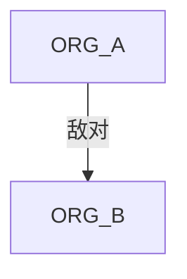

## Skill：势力/阵营关系与权力结构（MVP）

### 目标
基于已知文本归纳势力清单、目标资源、盟友/敌对/附庸关系，并输出 Mermaid 关系图。

### 输入（契约）
- 章节正文/大纲/canon（至少其一）

### 输出（契约）
- 结构化产物（必需）：`schema: novel.factions.v1`（YAML）
- Mermaid 图（必须）

### 输出格式（YAML + Mermaid）
```yml
schema: novel.factions.v1
factions: []
edges: []
questions: []
```



