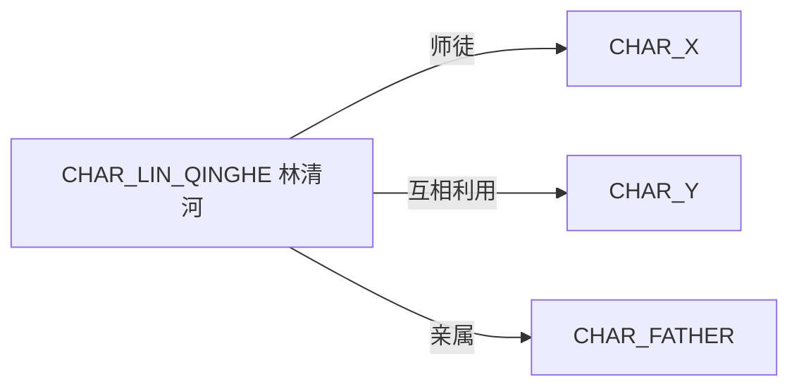
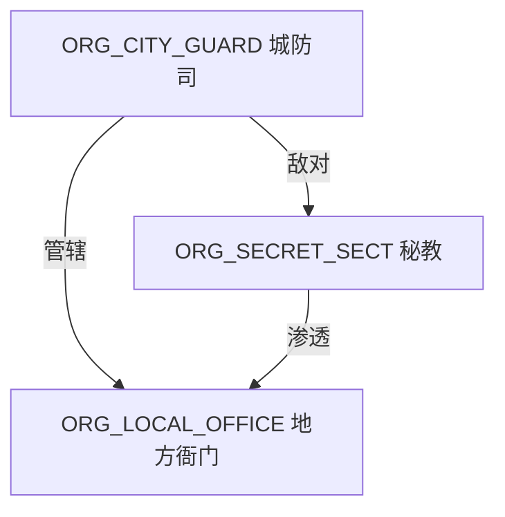

# 写小说 AI 软件（单人 MVP）拆分说明

本文件用于把“写小说的 AI 软件”按 `skill / tool / agent` 拆解成可落地的最小闭环设计，默认不考虑协作与发布。

## 概念定义

- **Skill**：可复用工作流/方法论（输入 → 产出 → 自检），可独立调用，也可被 Agent 编排。
- **Tool**：能力接口/外部系统（存取数据、检索、导入导出、评测等），为 Skill/Agent 提供可执行能力。
- **Agent**：扮演某个角色的执行体，负责拆任务、组装上下文、选择 Skill、调用 Tool，并产出最终结果。

## MVP 交付物（落地版：做完你能用到什么）

以“单人、本地、可反复写章”为目标，MVP 最终应当至少交付以下内容（否则很难真正进入写作闭环）：

1. **一个可初始化的小说工程目录**：`novel/` 下有固定结构（章节、canon、notes），并带最小 `config.yml`。
2. **一套可直接调用的 Skills**：点子/大纲/写手/监修/润色等能跑通，并且能产出结构化块供写回。
3. **一组最小 Tools**：能读写 chapter/canon，能生成 diff/回滚，能做一致性校验。
4. **一条明确的“从 0 到一章成品”的操作路径**：哪怕只是命令/模板，也要能照着做完。

> 原则：MVP 不追求“写得多好”，但必须追求“写得稳、能对账、能回滚、不会越写越乱”。

## MVP 范围与非目标（避免做散）

### MVP 要做（必须）

- 本地单人写作闭环：`规划 → 产出 → 对账 → 修订 → 写回 canon`。
- Canon 最小数据库：人物/规则/时间线/伏笔/术语，支持“来源章节可追溯”。
- 章节版本化：至少能看 diff、能回滚到上一个稳定版本（按文件即可）。
- 导入导出：按章节 Markdown 导入/导出（先不做 Docx/PDF）。
- 最小质量闸门：能把“重大冲突/缺信息/未写回”挡住，而不是只给建议。

### 交付约束：全部内置于项目（不依赖外部配置）

本 MVP 文档里提到的 **所有 Skills / Tools / Agents / Commands** 都必须满足：

- **已编码实现并随仓库交付**：要么是 `packages/opencode` 内的内置实现，要么是仓库内 `.opencode/` 下的可执行代码/模板（同样随项目提交）。
- **零额外配置即可使用**：用户 clone/install 后，不需要再去 `~/.claude/skills`、环境变量、手工复制文件等做“额外配置”才能跑通流程。
- **不引用外部隐式状态**：运行不依赖用户 home 目录里预置的 skill/tool/agent；如有同名外部项，MVP 行为以项目内版本为准（或显式禁用外部加载）。

> 允许的“生成物”：`novel-init` 在项目目录内生成 `novel/` 工程文件（属于写作产物，不算“额外配置”）。这些文件应带默认值，用户不改也能继续跑通后续命令。

### MVP 不做（明确非目标）

- 多人协作、冲突合并、权限系统、云端同步、发布平台对接。
- 复杂检索（向量库/知识图谱自动推理）与大规模评测体系。
- 全自动“长篇一键生成”（会牵出 token/一致性/审美不可控的问题）。

## 交互形态（推荐按 opencode 现有机制落地）

为了最快落地，优先用 opencode 已有的 `skill / agent / command / tool` 机制，而不是先做新 UI。

### 最小可用交互（两选一，推荐 A）

**A. Command 驱动（推荐，最快）**

- 在 `.opencode/command/` 提供 5~7 个固定命令模板（用户只填少量参数）：
  - `novel-init`：初始化 `novel/` 目录与 `config.yml`
  - `novel-idea`：生成题材/设定草案并写入 `notes/ideas.md`
  - `novel-plan <CH_..>`：生成章纲+场景卡并写入 `outlines/`
  - `novel-draft <CH_..>`：按场景卡产出正文并写入 `chapters/`
  - `novel-check <CH_..>`：对账 canon/时间线/伏笔，输出问题清单与最小修复方案
  - `novel-polish <CH_..>`：润色/节奏调整（保守/重写两档）
  - `novel-export`：导出单章/全书（Markdown 拼接即可）

**B. 单一 Orchestrator Agent（次选）**

- 在 `.opencode/agent/` 提供一个“小说总控” agent，让用户用对话驱动，但仍强制走结构化输出与写回。

## 章节文件规范（Markdown 也要可对账）

仅靠自然语言很难稳定对账，建议给每章加 YAML frontmatter（MVP 级别就够用）：

```md
---
id: CH_01_003
title: "档案室"
pov: CHAR_LIN_QINGHE
time_anchor: "EVT_01_0001_FATHER_MISSING+3d" # 可选；不做日期也能定位
locations: [LOC_CITY_A]
participants: [CHAR_LIN_QINGHE, CHAR_X]
refs:
  rules: [RULE_MAGIC_COST]
  foreshadow: [FB_0001_RING_SYMBOL]
status: draft # draft | reviewed | final
---
```

场景建议显式标 ID，便于定位埋点/回收点：

```md
## SC_CH_01_003_01 进入档案室
...正文...
```

## 上下文拼装规则（决定“能不能写稳”）

MVP 里最容易翻车的是：上下文塞不下、检索不准、越写越漂移。建议明确一套“Context Builder”规则：

1. **硬引用优先**：从章 frontmatter 的 `participants/locations/refs` 直接拉取对应 canon 条目。
2. **近因补全**：额外拉取最近 N 章（例如 2~3 章）的“状态变更摘要”（而不是整章正文）。
3. **冲突敏感**：如果本章计划引入新设定/新人物，必须把“已有相近条目”一并提供给模型做去重与对齐。
4. **token 预算**：固定预算（例如 8k/16k），超出就先压缩 `chapters/`，保留 `canon/` 的结构化条目。
5. **可追溯引用**：所有生成内容若引用 canon，必须能回指到 `id`，不能只写人名/设定名。

输出给模型的上下文建议分块（顺序很重要）：

1) 任务说明（本次要做什么）  
2) 章目标/场景卡（结构约束）  
3) Canon（人物/规则/时间线/伏笔/术语）  
4) 最近章节摘要（可选）  
5) 风格约束（口吻、禁用词、叙事视角）  

## 必备 Skills（MVP）

1. **点子/设定生成**：脑洞、题材约束、冲突升级路线（输出：设定条目草案 + 禁忌清单）。
2. **大纲与节拍**：章纲、场景卡、信息投放策略（输出：章纲 + 场景卡列表）。
3. **人物卡与动机**：人设一致性、弧光、关系网（输出：人物卡 + 关系边列表；可选 Mermaid 人物关系图）。
4. **世界观规则与硬约束**：魔法/科技/社会规则自洽（输出：规则表 + 例外与代价）。
5. **续写承接**：承上启下、转场、伏笔接力（输出：下一段/下一章正文 + 继承的状态变化）。
6. **润色与改写**：保守润色/重写润色、节奏与信息密度（输出：修改稿 + 修改摘要）。
7. **缺点诊断**：逻辑漏洞、节奏水、动机牵强、视角问题（输出：问题清单 + 优先级 + 修复方案）。
8. **伏笔/承诺追踪与回收对账**：挖坑-埋点-回收（输出：伏笔表 + 未回收项 + 补写点位）。
9. **摘要与文案**：章节回顾、简介、卖点提炼（输出：无剧透/含剧透两版摘要 + 卖点 bullets）。
10. **势力/阵营关系与权力结构**：势力清单、目标与资源、盟友/敌对/附庸/渗透、冲突格局（输出：势力表 + 关系边列表 + Mermaid 势力关系图；可选权力结构树）。

> 如果项目里暂时没有“关系梳理”相关 Skill：最低要求是按 Markdown 表格 + Mermaid 图输出关系（只基于已有文本/大纲归纳，不凭空补史实/经历）。

## 关键 Tools（MVP 级别）

目标是“像软件”：可追溯、可检索、可回滚、可对账。向量检索/复杂评测可后置。

1. **长期记忆库（结构化 + 检索）**
   - `人物表`：id、别名、外观、动机、口癖、关系、状态字段
   - `设定表`：id、规则、限制、代价、例外、首次出现章
   - `时间线事件表`：id、时间点、参与者、地点、因果、对状态的影响
   - `术语表`：固定译名/命名规则/禁用词
2. **Canon/版本系统（最小版）**
   - 章节版本、差异对比、回滚
   - “引用来源”：设定/人物条目第一次出现在哪章（至少能回指到章节 id）
3. **时间线与关系图生成（文本版即可）**
   - 输出 Mermaid：人物关系网（CHAR）、势力/组织关系网（ORG）、时间线（EVT）供人工快速审阅
4. **导入导出**
   - Markdown 分章导入/导出（先不做 Docx 也可）

## Tool 接口建议（细到可以开工）

只要把“读写 + 校验 + 版本”做扎实，MVP 就能跑起来。建议把工具接口拆到可组合的最小颗粒（下面是建议清单，不要求一次全做完）：

### 文件与版本

- `novel.fs.read(path)`：读取 `novel/` 内文件（Markdown/YAML/JSON）
- `novel.fs.write(path, content, mode)`：写入（`mode`: `create|overwrite|append`）
- `novel.fs.diff(path, aRef, bRef)`：生成差异（最小：git diff）
- `novel.fs.rollback(path, ref)`：回滚到指定版本（最小：git checkout/restore）

### Canon CRUD（结构化）

- `novel.canon.get(kind, id)`：按 `kind=characters|factions|rules|timeline|foreshadow|glossary` 取条目
- `novel.canon.upsert(kind, item, source)`：新增/更新条目（强制带 `source.chapter`）
- `novel.canon.search(kind, query)`：关键词检索（MVP 先用文本匹配即可）
- `novel.canon.validate(chapterId?)`：校验：ID 合法、引用存在、必填字段齐全、伏笔状态机合法

### 图与报表（人工审阅友好）

- `novel.graph.timeline()`：输出 Mermaid 时间线
- `novel.graph.relations()`：输出 Mermaid 关系网
- `novel.report.chapter(chapterId)`：输出“本章新增设定/状态变更/新增伏笔/回收伏笔”摘要

> 落地建议：先用 git 作为版本系统（最省事且可追溯）；canon 写回先生成“补丁提案”（diff/patch），由用户确认后应用，避免模型误写。

## 推荐 Agents（单人闭环）

- **Orchestrator（总控）**：拆任务、组装上下文、选择 Skill、调用 Tool、出最终稿。
- **Planner（策划）**：大纲/节拍/信息投放（偏“结构正确”）。
- **Writer（写手）**：按场景卡输出正文（偏“产出速度与可读性”）。
- **Editor（编辑）**：逻辑与语言层面的修改建议 + 可一键应用的修订说明。
- **Continuity/Canon（监修）**：对账设定、时间线、人物关系、伏笔清单。

---

## 统一：Skill 模板（输入/输出契约）

建议每个 Skill 都遵守同一份模板，这样 Orchestrator 才能稳定编排、自动对账、自动写回记忆库。

> 最关键：**输出必须包含结构化块（JSON/YAML/表格任选一种）**，自然语言解释作为附录。

### Skill 模板（Markdown）

```md
## Skill：<名称>

### 目标
一句话说明这个 Skill 产出什么、解决什么。

### 输入（契约）
- 需要哪些材料（前文范围/人物表/设定表/章节目标/风格约束）
- 不允许缺省的必填字段

### 输出（契约）
- 结构化产物（必需）：<Schema 版本号>
- 自然语言说明（可选）

### 步骤
1) ...
2) ...

### 自检清单（必须逐条回答）
- [ ] 是否引入新设定？若是，写入设定表并标注来源章节
- [ ] 是否改变人物状态？若是，写入人物状态变更
- [ ] 是否新增伏笔？若是，生成 FB_ 记录并标注埋点位置

### 失败与兜底
- 如果信息不足：列出缺失项并给“最小补齐提问”
```

---

## 统一：ID 与引用规范（Canon/对账的基础）

建议全局唯一、可读、可追溯（可选加短哈希防重名）。

### 前缀规范

- 人物：`CHAR_<简名>`（例：`CHAR_LIN_QINGHE`）
- 地点：`LOC_<简名>`
- 组织/势力：`ORG_<简名>`
- 物品：`ITEM_<简名>`
- 规则/设定：`RULE_<简名>`
- 事件：`EVT_<YYYYMMDD>_<简名>` 或 `EVT_<递增序号>_<简名>`
- 伏笔/承诺：`FB_<递增序号>_<简名>`
- 章节：`CH_<卷>_<章>`（例：`CH_01_003`）
- 场景：`SC_<章节ID>_<序号>`（例：`SC_CH_01_003_02`）

### 引用规则

- 正文/场景卡里引用设定、人物、伏笔时，建议在段尾或旁注写：`[REF: RULE_xxx, FB_xxx, CHAR_xxx]`
- 每次新增/修改条目，必须写 `source.chapter`（来源章节）与可选 `source.quote`（原句或摘要）

---

## 数据结构（最小可用 Schema）

下面给出最小字段集合（可扩展）。建议用 YAML 存储，便于手改；也可换 JSON。

### 人物表（characters.yml）

```yml
- id: CHAR_LIN_QINGHE
  name: 林清河
  aliases: ["清河"]
  role: 主角
  motivation: "查清父亲失踪真相"
  desire: "被认可"
  flaw: "过度逞强"
  voice:
    catchphrases: ["……行。", "别问。"]
    taboo: ["现代网络梗", "过度解释"]
  relations:
    - to: CHAR_X
      type: 师徒
      status: 紧张
  state:
    location: LOC_CITY_A
    health: 100
    mood: "压抑"
  canon:
    first_appearance: CH_01_001
    notes: "发色/口音不要变"
```

### 势力表（factions.yml）

```yml
- id: ORG_CITY_GUARD
  name: 城防司
  type: 官署
  goal: ["维持城内秩序", "压下禁术传闻"]
  resources: ["巡逻队", "拘押权", "城内线人"]
  methods: ["强硬盘查", "以案牵连", "选择性放行"]
  territory: [LOC_CITY_A]
  representatives: [CHAR_X]
  relations:
    - to: ORG_SECRET_SECT
      type: 敌对
      status: 升温
      stake: "禁术线索"
  canon:
    first_appearance: CH_01_002
```

### 设定表（rules.yml）

```yml
- id: RULE_MAGIC_COST
  name: 施法代价
  rule: "每次施法消耗记忆碎片"
  constraints: ["连续施法会短期失忆"]
  exceptions: ["祭器可缓冲一次"]
  introduced_in: CH_01_002
  impacts:
    - affects: CHAR_LIN_QINGHE
      effect: "越强越容易忘掉关键线索"
```

### 事件表（timeline.yml）

```yml
- id: EVT_01_0001_FATHER_MISSING
  at: "CH_00_000" # 也可以是“时间点/日期”，MVP 直接用章节锚点
  title: 父亲失踪
  participants: [CHAR_FATHER]
  location: LOC_CITY_A
  cause: "调查禁术"
  effect:
    state_changes:
      - target: CHAR_LIN_QINGHE
        set:
          goal: "追查父亲"
```

### 伏笔表（foreshadow.yml）

```yml
- id: FB_0001_RING_SYMBOL
  promise: "戒指上的纹章意味着更大势力介入"
  planted_in:
    chapter: CH_01_001
    scene: SC_CH_01_001_03
    note: "只露出纹章，不解释"
  status: planted # planted | escalated | paid_off | dropped
  planned_payoff: CH_01_010
  payoff:
    chapter: null
    note: null
```

---

## 产物目录结构（建议）

不做协作/发布时，仍建议固定目录，便于 Tool 检索与脚本化。

```text
novel/
  config.yml
  chapters/
    CH_01_001.md
    CH_01_002.md
  outlines/
    CH_01_003.outline.md
  canon/
    characters.yml
    factions.yml
    rules.yml
    timeline.yml
    foreshadow.yml
    glossary.yml
  notes/
    ideas.md
    scenes.md
```

### 工程配置（novel/config.yml）

MVP 先把“可复现/可控”的参数固定下来，避免同样输入每次产出风格完全不同：

```yml
project:
  title: "未命名长篇"
  language: "zh-CN"
  pov_default: "第三人称有限"

model:
  provider: "openai" # 或其他；不要把供应商写死在逻辑里
  model: "gpt-4.1-mini"
  temperature: 0.8
  max_output_tokens: 3000

context:
  token_budget: 16000
  recent_chapter_window: 3

style:
  taboo: ["现代网络梗", "过度解释", "说教式总结"]
  tone: ["克制", "有画面感"]

workflow:
  require_patch_review: true # 写回 canon 前必须人工确认补丁
```

---

## 最小写作流水线（默认闭环）

1. Planner：输出章纲 + 场景卡（写明信息点与伏笔 ID）
2. Writer：按场景卡生成正文（每段标注涉及的设定/人物/伏笔 ID）
3. Continuity：跑一致性对账（人物状态/时间线/设定冲突/伏笔状态）
4. Editor：润色 + 删除冗余 + 修正视角/节奏
5. Orchestrator：合并成最终章 + 写回记忆库（状态更新、伏笔状态更新）

### “通过标准”（每章交付时必须满足）

- [ ] 本章新增设定已写入 `canon/rules.yml`，且标注 `introduced_in`
- [ ] 本章人物状态变更已写入 `canon/characters.yml`（至少写 location/mood/关键伤势）
- [ ] 本章新埋伏笔已写入 `canon/foreshadow.yml`，且标注 planted 位置
- [ ] 本章对上一章承诺有推进（至少 1 条：升级/误导/回收/反转）
- [ ] 本章不存在“读者必需信息缺失”（Continuity/Editor 给出结论）

## 最小评测与验收（MVP Done Definition）

除了“通过标准”，建议再加一层更可量化的验收，避免只靠主观感觉：

### 章节级验收（每章）

- [ ] **引用可追溯**：本章所有 `[REF: ...]` 对应的 ID 在 `canon/` 中存在
- [ ] **新增条目已写回**：本章引入的新人物/新规则/新伏笔都有结构化记录与 `introduced_in/source`
- [ ] **时间线无硬冲突**：同一角色在同一时间锚点不处于互斥地点/状态（MVP 可用规则校验 + 人工确认）
- [ ] **人物口吻无明显漂移**：至少对主角/核心配角做一次“口癖/禁用词”检查
- [ ] **伏笔状态机合法**：`planted → escalated → paid_off` 不允许跳跃或重复回收

### 工程级验收（能持续用）

- [ ] `novel/` 目录可在新机器上直接继续写（只依赖文件与模型配置，不依赖隐藏状态）
- [ ] 任意章节可以回滚到上一版并重新跑 `check` 得到一致结果（允许文案不同，但结构化对账结果应一致）

---

## 冲突与修复策略（不加新模块的前提下）

当 Continuity 检测到冲突时，不只报错，必须给“最小改动修复方案”：

1. **设定冲突**（规则互斥/代价不一致）
   - 优先级：`已写死的关键剧情 > 先前明确陈述的设定 > 当前章节的便利设定`
   - 修复手段：补充例外条款 / 调整代价 / 把冲突改成“误解”并在正文中埋解释点
2. **时间线冲突**（一天走两地/事件顺序不可能）
   - 修复手段：改时间锚点、加转场、删/并场景、把“发生”改成“听说/回忆”
3. **人物动机冲突**（角色突然反常）
   - 修复手段：补一段内心动因/触发点；或把行为拆成“被迫/误会/交换条件”
4. **伏笔未回收**
   - 修复手段：明确延期回收章节；或在本章做一次升级（status: escalated）维持读者期待

## 里程碑（建议按 7～14 天拆）

如果目标是“尽快开始写”，可以按下面顺序做（每一步完成就能产生可用增量）：

1. **工程初始化与目录约定**：生成 `novel/` 目录 + 最小 `config.yml` + 示例 canon 文件
2. **Canon 读写与校验**：实现 `canon.get/upsert/validate`，把“写回”打通
3. **章节 plan/draft 的命令模板**：固定输入字段与输出 schema，先别追求智能检索
4. **对账与最小修复提案**：`novel-check` 先能抓到“引用缺失/未写回/状态机非法”
5. **版本与回滚**：接入 git diff/rollback，确保可控迭代
6. **上下文拼装（Context Builder）**：最后再优化“写得更像人、更稳定”

## 风险与降级（MVP 常见坑）

- **越写越乱（canon 漂移）**：强制结构化引用 + `canon.validate` 必过；写回走补丁审核。
- **上下文塞爆**：压缩“正文”，保留“结构化 canon”；近因补全只用摘要，不搬整章。
- **模型胡编新设定**：发现“新增设定”但没写回时直接拦截，要求补齐条目或改写正文去掉它。
- **修复建议不可执行**：Continuity 的输出必须包含“最小改动方案”（改哪一段/加哪一句/延期到哪章）。

---

## 附：大纲与节拍 Skill 的输出建议（结构化）

输出建议固定为两块：`章纲[]` + `场景卡[]`。

```yml
chapter_outline:
  - chapter: CH_01_003
    chapter_goal: "拿到线索 A"
    turn: "线索 A 指向敌人 B"
    cliffhanger: "出现与父亲同款纹章"

scene_cards:
  - id: SC_CH_01_003_01
    goal: "进入档案室"
    obstacle: "门禁与巡逻"
    turn: "发现钥匙在盟友身上"
    info_drop: ["RULE_MAGIC_COST", "FB_0001_RING_SYMBOL"]
    state_change:
      - target: CHAR_LIN_QINGHE
        set: { mood: "警惕" }
```

## 附：关系图输出模板（Markdown + Mermaid，缺 Skill 时也能用）

### 人物关系图（示例）



### 势力关系图（示例）



### 输出要求（强约束）

- 节点 ID 必须使用前缀规范（`CHAR_` / `ORG_` / `LOC_` 等），并尽量附带可读名。
- 边必须标注关系类型（盟友/敌对/附庸/交易/渗透/表面联盟/利用/亲属/师徒…）。
- 如果信息不足：先列 3 个以内“最小补齐提问”，再给一个“不推测版”的图（用 `unknown`/`?` 标注不确定边）。
